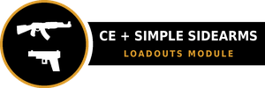

# CombatExtended-SimpleSidearms Compatibility Module - Loadouts

RimWorld 1.6 mod unifying [Combat Extended](https://github.com/CombatExtended-Continued/CombatExtended)
loadouts and [Simple Sidearms](https://github.com/PeteTimesSix/SimpleSidearms) memory into one
mental model. Builds on (and requires) the
[CE + Simple Sidearms Compatibility patch](https://github.com/eebette/CombatExtended-SimpleSidearms-Compatibility-Patch).

## The suite

The core, repair-only patch — **required** by this module. Eleven repair axes so
CE and Simple Sidearms work as their authors intended.

Sibling module (not required): combat-time weapon choice — reload-abort when
threatened, target-aware ammo and armor-aware melee scoring.

## The model

- **CE loadout = template layer** (shared template): consumables policy, and weapon slots as
  kit declarations.
- **SS sidearm memory = instance layer** (per-pawn working kit): the authority on which
  weapons a pawn maintains.
- Two one-way derivations connect them; no state can desync, no cycles.

## Features (each toggleable in mod settings)

**Loadout weapons as sidearms** — every weapon def listed in a CE loadout is remembered as a
sidearm by the pawns assigned to it. The first declared ranged weapon becomes their default
ranged weapon and the first declared melee their preferred melee weapon; the rest are
backups. Remove a weapon from the loadout and it is forgotten again, which is what lets CE
clear it out of the inventory — CE's own `dropUndefined` and ad-hoc rules then decide what
actually happens to it, exactly as they do for any other undeclared item.

**Whatever the loadout lists, the loadout owns**, including weapons Simple Sidearms had
already remembered on its own — it auto-remembers anything a pawn equips as primary, which is
the usual case when you build a loadout around a gun a pawn already carries. Defs the loadout
never lists are not touched.

Two things outrank the loadout, both because they are explicit:

- **Forcing a weapon** (SS's force gizmo) and **"prefer unarmed"** are never touched. SS
  checks a forced weapon before any default, and its role setters would clear these as a side
  effect, so the projection stays out of the way entirely.
- **A weapon you equip that the loadout doesn't list** keeps the role for as long as the pawn
  is carrying it. Put it away and the loadout's first takes over — SS ignores a role pointing
  at a weapon the pawn hasn't got, and would otherwise fall back to picking by raw DPS.
- **A role you clear by hand stays cleared.** SS has a "prefer unarmed" flag but no ranged
  equivalent, so without this the projection would put a cleared default ranged weapon back
  within the minute. Set a role again and the loadout resumes managing it.

Player intent is read inside the sidearm gizmo's own interaction, never inferred afterwards
from a missing memory: SS drops memories on its own — every equip forgets the outgoing
primary — so absence means nothing by itself. Anything the gizmo does while the player is
clicking is theirs; everything else is not.

A declared weapon is remembered once the pawn actually **has** one, not when the row is added.
The row already makes CE fetch it, and guessing a material before it arrives would send SS
hunting a specific stuff the loadout never asked for.

**Forget a declared weapon in SS's gizmo and it stays forgotten** — that is how you say *carry
this but don't wield it*, which removing the loadout row cannot express (that would stop the
pawn carrying it at all). The game will not arm the pawn with it on its own: CE's inventory
picks and its loadout equip jobs are refused, and Simple Sidearms' own switching —
idle re-arm, the melee swap when an enemy closes — skips it too. CE still hauls it for the
loadout row exactly as before. To undo it: equip the weapon yourself — from the map
right-click menu, the inventory tab, or the caravan gear tab — click it back into the
sidearm list in SS's gizmo (or force it, while drafted), or remove and re-add its loadout
row; any of those puts it back under loadout management immediately. Exclusions belong
to the loadout assignment: assigning a different loadout (or losing the current one)
clears them all, along with any hand-cleared roles — they are per-assignment rules, not
permanent flags, and they do not come back when the old loadout does. While one is
active, Simple Sidearms' own gizmo shows the weapon with its blocked cross and the
reason.

Generic slots ("any ranged weapon") are ignored — there is no specific def to remember —
and so are CE's modular weapon platforms, whose attachments cannot be captured in the
def-plus-material pair Simple Sidearms remembers by. Both stay in the loadout and are
hauled as normal; they just are not projected into the sidearm list.

**Ammo for your sidearms is Combat Extended's job.** Add the ammo to the loadout and CE keeps
the pawn stocked to that count — the same mechanism it uses for everything else, visible in
the loadout UI, and it works whether or not the weapon itself is declared. This module used to
derive that demand automatically off CE's per-loadout "Ad hoc" checkbox; that was wrong.
Ad-hoc means *this pawn's primary is not in the loadout — keep it and feed it*, so borrowing
it for declared sidearms both changed CE's drop behaviour for anyone who wanted sidearm ammo
and forced ammo demand on anyone who wanted ad-hoc for its real purpose.

**Multiplayer is untested.** The player-gesture tracking runs on UI interaction scopes; how
those behave under RimWorld Multiplayer's synchronisation has not been verified.

**What this does not enforce.** Simple Sidearms has settings limiting how many sidearms a
pawn may carry and how heavy each may be relative to them. Those govern what a pawn picks up
*on their own*; a loadout row is an explicit order, so a declared weapon is claimed
regardless. Weapons the pawn cannot use at all — bonded or biocoded to someone else, banned
by an ideoligion role, or any weapon on a pawn who cannot do violence — are still skipped.

## Building

Same pattern as the compat patch: `dotnet build Source/CESidearmsSupply/CESidearmsSupply.csproj -c Release`.
References the CE and SS workshop DLLs (`-p:RimWorldWorkshopDir=...` to override). The
compatibility patch is a runtime dependency but not a build one — this module binds to no
type in it. CI cannot build this repo; releases are manual.

## Load order

Harmony → Combat Extended → Simple Sidearms → CE+SS Compatibility → this mod (declared in About.xml).

## License

[MIT](LICENSE) — code, build files, and docs.

The badge artwork is not: `About/Preview.png` and the `Media/Badge_*.png` set remix the rifle
glyph from Combat Extended's own compatibility badge, so they stay under CE's CC BY-NC-SA 4.0
(attribution, non-commercial, share-alike). Details in [NOTICE](NOTICE).
